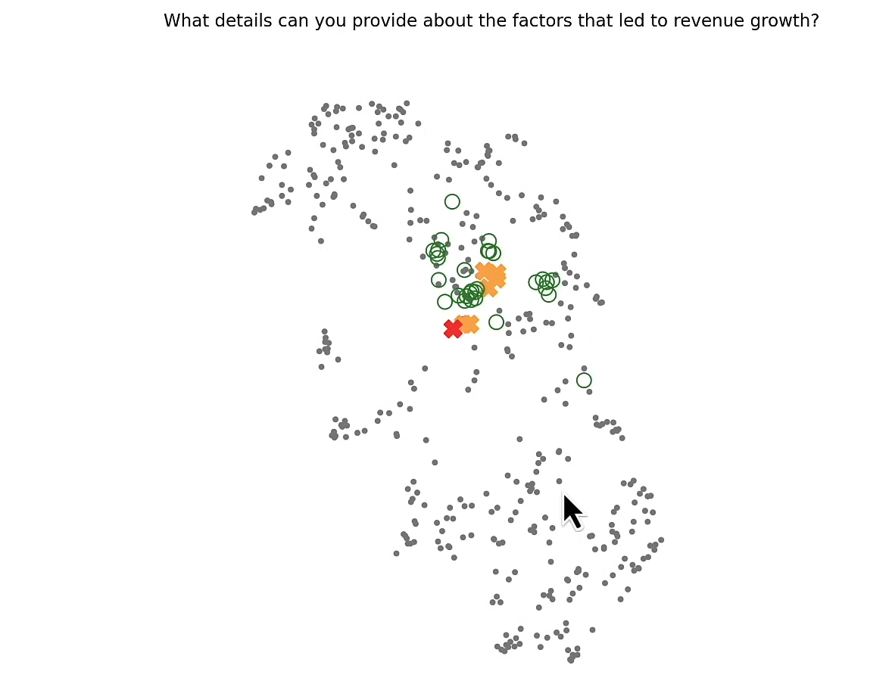

# Advanced RAG — Query Augmentation & Embedding Visualisation

An advanced Retrieval-Augmented Generation (RAG) pipeline that improves retrieval quality through query augmentation, then visualises the results in embedding space using UMAP.

## What it does

Standard RAG retrieves documents using a single query. This implementation expands that query into multiple related questions using an LLM, then queries the vector store with all of them simultaneously — casting a wider semantic net to surface more relevant chunks.

The results are projected into 2D using UMAP and plotted to visually compare how the augmented queries relate to the retrieved documents vs the original query.

## Techniques used

| Technique | Description |
|---|---|
| Two-stage chunking | Character splitting → token splitting (256 tokens/chunk) |
| Sentence Transformer embeddings | Local embeddings via `all-MiniLM` (no API cost) |
| Query augmentation | LLM generates 5 related sub-questions from the original query |
| Multi-query retrieval | All augmented queries run against ChromaDB simultaneously |
| Deduplication | Retrieved documents deduplicated across all query results |
| UMAP visualisation | Embedding space projected to 2D to inspect retrieval quality |

## Pipeline flow

```
PDF → Character split → Token split → ChromaDB (in-memory)
                                              ↓
Original query → LLM → Augmented queries → ChromaDB query
                                              ↓
                              Retrieved chunks + embeddings
                                              ↓
                              UMAP projection → matplotlib plot
```

## Visualisation guide

The scatter plot shows four layers:

- **Gray dots** — all document chunks in the vector DB
- **Orange X** — augmented query embeddings (should cluster near retrieved docs)
- **Green circles** — retrieved document chunks
- **Red X** — original query embedding

A well-tuned pipeline shows the orange X markers sitting closer to the green circles than the red X, confirming the augmented queries are semantically richer and better aligned with relevant content.

## Project structure

```
fundamentals-advancedRAG/
├── advanced_main.py      # Main pipeline
├── helper_utils.py       # project_embeddings(), word_wrap(), load_chroma()
├── data/
│   └── *.pdf             # Source PDF documents
└── README.md
```

## Setup

```bash
pip install openai chromadb langchain-text-splitters pypdf sentence-transformers umap-learn matplotlib python-dotenv
```

Create a `.env` file in the project root:

```
OPENAI_API_KEY=your_key_here
```

## Run

```bash
python advanced_main.py
```

> Note: ChromaDB runs in-memory — no vector DB folder is created. Data is rebuilt on every run.

## Dependencies

| Package | Purpose |
|---|---|
| `openai` | Query augmentation via Chat Completions API |
| `chromadb` | In-memory vector store |
| `sentence-transformers` | Local embedding model |
| `langchain-text-splitters` | Character and token-level chunking |
| `pypdf` | PDF text extraction |
| `umap-learn` | Dimensionality reduction for visualisation |
| `matplotlib` | Scatter plot rendering |
